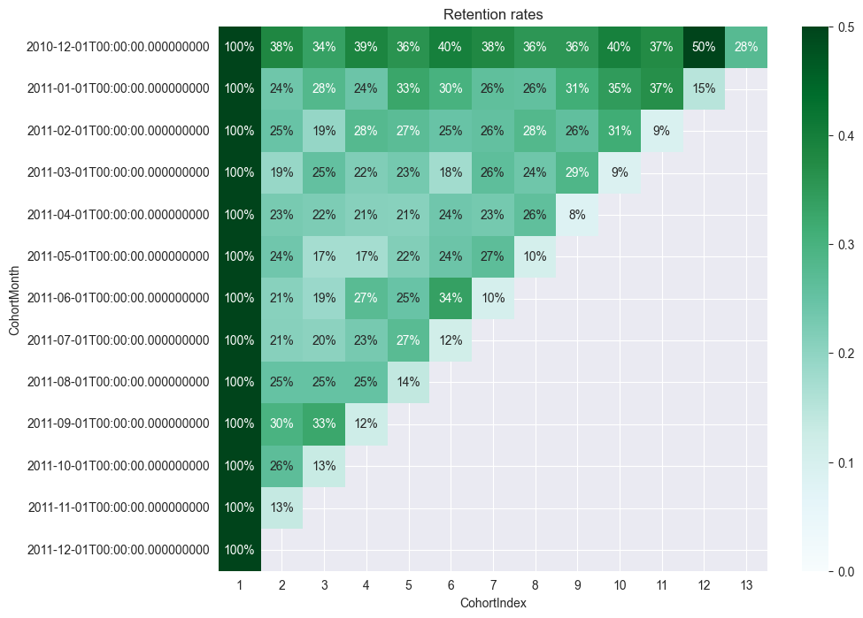

# **Unveiling Insights: A Journey Through Online Retail Transactions**

## **Introduction**

Every data project begins with a question. It sounds simple, even obvious, yet many aspiring data professionals fall into the trap of diving headfirst into data—cleaning, filtering, and visualizing—without first defining the problem they want to solve. A true professional, however, approaches data with curiosity and structure, always starting with a well-defined question.

This project is designed not just as an analysis but as a guided journey. Whether you're an HR manager evaluating my analytical skills or an aspiring data scientist looking to learn alongside me, this project aims to be both informative and engaging.

---

## **About the Dataset**

The dataset explored here contains **over 500,000 transactions** from an online retail store, spanning **December 2010 to December 2011**. It provides detailed information on:

- **Invoice numbers** (to track unique transactions)  
- **Stock codes and product descriptions** (to identify items sold)  
- **Quantities and unit prices** (to calculate revenue and sales trends)  
- **Timestamps** (to analyze seasonal patterns and shopping behaviors)  
- **Customer IDs** (to explore customer retention and segmentation)  
- **Geographical data** (to uncover purchasing trends across different countries)

This dataset presents a **fantastic opportunity to extract meaningful insights**, visualize trends, and tell compelling data-driven stories. Through this project, we will answer key business questions such as:

1. Which countries contribute the most to total revenue?  
2. Are there seasonal trends that influence customer spending?  
3. Can we identify loyal customers and their purchasing behaviors?  
4. What are the most popular products, and how do their sales fluctuate over time?

We answer questions 1 and 2 in this analysis, and **questions 3 and 4 are handled in a separate notebook** involving unsupervised machine learning techniques.

---

## **Table of Contents**

1. [Overview](#overview)  
2. [Data Description](#data-description)  
3. [Analysis & Visualizations](#analysis--visualizations)  
   - [Cohort Analysis](#1-cohort-analysis)  
   - [RFM Clustering & Snake Plot](#2-rfm-clustering--snake-plot)  
   - [RFM 3D Scatter Plot (PCA)](#3-rfm-3d-scatter-plot-pca)  
   - [Monthly Trends Dashboards](#4-monthly-trends-dashboards)  
   - [Revenue Contribution by Country](#5-revenue-contribution-by-country)  
   - [Seasonal Shopping Behavior](#6-seasonal-shopping-behavior)  
4. [Findings & Analysis](#findings--analysis)  
5. [Next Steps](#next-steps)  
6. [Project Structure](#project-structure)  
7. [How to Run](#how-to-run)  

---

## **Overview**
This repository focuses on uncovering **purchasing behavior** and **customer retention** through:
- **RFM (Recency, Frequency, Monetary) segmentation and clustering**  
- **Cohort analysis** for monthly retention  
- **Country-level revenue distribution**  
- **Seasonal spending patterns**  
- **Monthly trends** in sales, returns, and overall revenue  

By integrating descriptive visualisations and storytelling, the analysis goes beyond raw numbers, revealing the patterns driving online retail transactions.

---

## **Data Description**

Below is a brief description of key columns in the **final dataset**:

| Column Name      | Description                                                    |
|------------------|----------------------------------------------------------------|
| **InvoiceNo**    | Unique identifier for each transaction.                        |
| **StockCode**    | Unique code for each product.                                  |
| **Description**  | Product name.                                                  |
| **Quantity**     | Number of units purchased per transaction.                     |
| **InvoiceDate**  | Date and time of the transaction.                              |
| **UnitPrice**    | Price per unit of the product.                                 |
| **CustomerID**   | Unique identifier for each customer.                           |
| **Country**      | Country where the transaction took place.                      |
| **Month**        | Extracted month of the transaction.                            |
| **CohortMonth**  | The first month the customer made a purchase.                  |
| **CohortIndex**  | Number of months since the first purchase.                     |
| **TotalSum**     | Total revenue (Quantity × UnitPrice).                          |
| **ClusterLabel** | Assigned customer segment (e.g., “Champions”, “Regulars”).     |

---

## **Analysis & Visualizations**

### **1. Cohort Analysis**


- **What it shows**: Monthly retention rates of customers from their cohort start month onward.  
- **Interpretation**: A higher percentage in any cell indicates that a good portion of that cohort returned to buy in that subsequent month.

---

### **2. RFM Clustering & Snake Plot**


- **What it shows**: Normalized Recency, Frequency, and Monetary scores for each customer segment.  
- **Interpretation**:
  - High lines = stronger dimension (e.g., high Frequency or Monetary).  
  - Low lines = weaker dimension (e.g., low Recency indicating older customers).

---

### **3. RFM 3D Scatter Plot (PCA)**


- **What it shows**: A 3D visualization (using principal component analysis) of customer segments.  
- **Interpretation**: Clusters (0, 1, 2) occupy distinct regions in the PCA space, reflecting differences in purchasing habits.

---

### **4. Monthly Trends Dashboards**


- **Monthly Sales Trend:** Tracks total quantities sold.  
- **Monthly Revenue Trend:** Shows overall revenue ($) per month.  
- **Monthly Returns Trend:** Identifies returned quantities, revealing potential seasonal spikes or issues.  
- **Customer Loyalty Categories:** Classifies customers (One-time, Occasional, Frequent, VIP).  
- **Revenue Share by Country:** Highlights which countries generate the most revenue.  
- **Seasonal Distribution of Transactions:** A pie chart illustrating transactions by Spring, Summer, Fall, Winter.

---

### **5. Revenue Contribution by Country**


- **What it shows**: Bar chart indicating major revenue contributors.  
- **Key Observations**:
  - **UK dominates** (most revenue).  
  - Smaller contributions from the Netherlands, Ireland, Germany, France, and Australia.

---

### **6. Seasonal Shopping Behavior**


- **What it shows**: Pie chart with transaction percentages for each season.  
- **Key Observations**:
  - **Fall (36.1%) and Winter (24.1%)** = peak shopping seasons (likely tied to holidays).  
  - **Spring (19.1%) and Summer (20.6%)** = comparatively slower periods.

---

## **Findings & Analysis**

### **Which countries contribute the most to total revenue?**
1. **The United Kingdom** is the dominant revenue generator.  
2. **Netherlands, Ireland, Germany, France, and Australia** follow but are significantly smaller.

#### **Implications**  
- **Market Expansion**: Launch targeted campaigns in underperforming regions.  
- **Localization**: Tailor currency, promotions, and partnerships to grow international share.  
- **Focus on Dominant Market**: Maintain strong loyalty programs for the UK’s large customer base.

---

### **Are there seasonal trends influencing customer spending?**
1. **Fall (36.1%) and Winter (24.1%)** have higher transactions, aligning with major holidays.  
2. **Spring (19.1%) and Summer (20.6%)** see a lull in spending.

#### **Implications**  
- **Holiday Prep**: Stock up on inventory, ramp up marketing pre-Fall & Winter.  
- **Slow Seasons**: Consider promotional events or discounts in Spring & Summer to bolster demand.  
- **Inventory Management**: Optimize product availability to avoid overstock or shortages.

---

### **RFM-Based Customer Segmentation**  
- **Champions**: High Recency, Frequency, Monetary. Likely brand advocates—reward them.  
- **Regulars**: Consistent but moderate spend—nudge them to spend more.  
- **Dormant**: Low engagement—reactivate with win-back campaigns.

---

### **Cohort Retention**  
- **Retention typically declines** over time for each new cohort.  
- **Early engagement strategies** can help keep more customers around longer.

---

## **Next Steps**
1. **Retention Strategy**  
   - Offer **VIP rewards** for Champions, upselling or cross-selling opportunities for Regulars, and win-back strategies for Dormant customers.  

2. **Advanced Analyses**  
   - **Market Basket Analysis** to identify commonly purchased item bundles.  
   - **Predictive Models** (e.g., churn forecasting) to intervene before customers become inactive.

3. **International Expansion & Localization**  
   - Test additional marketing channels in underrepresented countries.  
   - Optimize local currency handling, shipping, and compliance.

4. **Seasonal Promotion**  
   - Increase marketing spend and product variety ahead of the Fall/Winter holiday rush.  
   - Stimulate demand during the slower Spring/Summer seasons with themed promotions.

---

## **Project Structure**
```
Ecommerce-RFM-Analysis/
├── data/
│   ├── online_retail.csv
│   ├── online_retail_clean.csv
│   ├── online_retail_rfm.csv
│   ├── rfm_table.csv
│   └── data_with_clusters_no_returns.csv
├── visuals/
│   ├── cohort_retention_heatmap.png
│   ├── rfm_snake_plot.png
│   ├── 3d_scatter_rfm.png
│   ├── ecommerce_dashboard.png
│   ├── revenue_by_country.png
│   └── seasonal_transactions.png
├── notebooks/analysis.ipynb             <-- Covers Q1 & Q2 (e.g., Revenue by country, seasonal trends)
├── notebooks/modeling.ipynb           <-- Covers Q3 & Q4 (e.g., Loyal customers, popular products)
├── requirements.txt
└── README.md
```

---

## **How to Run**

1. **Clone the repository**  
   ```bash
   git clone https://github.com/YourUserName/Ecommerce-RFM-Analysis.git
   cd Ecommerce-RFM-Analysis
   ```

2. **Install the dependencies**  
   ```bash
   pip install -r requirements.txt
   ```

3. **Open the notebooks**  
   - `analysis.ipynb` explores revenue by country and seasonal patterns.  
   - `modelling.ipynb` delves into RFM segmentation and clustering.  
   ```bash
   jupyter notebook notebook_part1_analysis.ipynb
   ```
   or
   ```bash
   jupyter notebook modeling.ipynb
   ```

4. **View Output**  
   - Visualisations, tables, and dashboards are generated inside the notebooks.  
   - Saved images reside in the `visuals/` folder for direct reference.

---

## Contact

- Created by Bekhruz.  
- Questions or suggestions? Feel free to open an issue or contact me directly.